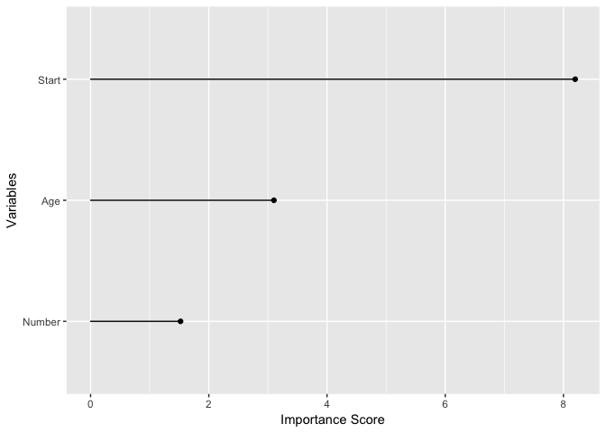
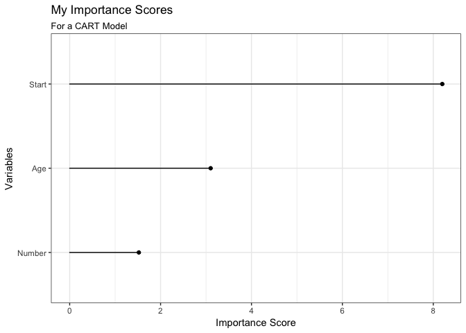
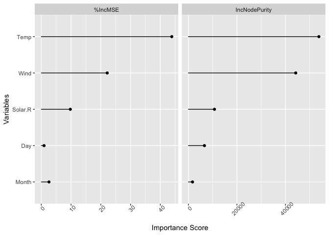
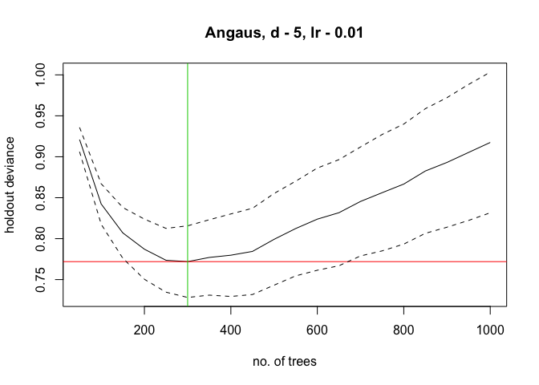
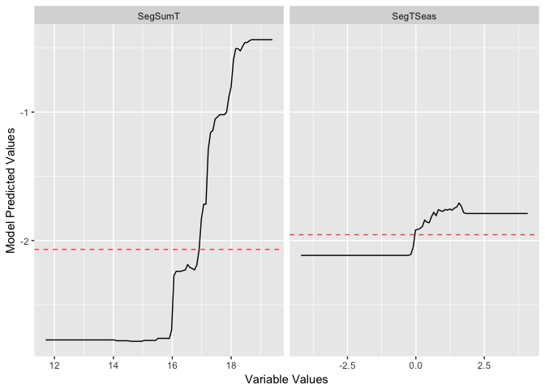

<!-- README.md is generated from README.Rmd. Please edit that file -->

# treezy

[](https://travis-ci.org/njtierney/treezy)[](https://ci.appveyor.com/project/njtierney/treezy)[](https://codecov.io/github/njtierney/treezy?branch=master)[](https://www.tidyverse.org/lifecycle/#experimental)

Makes handling output from decision trees easy. Treezy.

Decision trees are a commonly used tool in statistics and data science,
but sometimes getting the information out of them can be a bit tricky,
and can make other operations in a pipeline difficult.

`treezy` makes it easy to:

  - Get varaible importance information
  - Visualise variable importance
  - Visualise partial dependence

The data structures created in `treezy` - `importance_table` are making
their way over to the
[`broomstick`](www.github.com/njtierney/broomstick) package - a member
of the broom family specifically focussing on decision trees, which
gives different output to many of the (many\!) [packages/analyses that
broom deals with](https://github.com/tidyverse/broom#available-tidiers).
I am interested in feedback, so please feel free to [file an
issue](github.com/njtierney/treezy/issues/new) if you have any
problems\!

# Installation

``` r

# install.packages("remotes")
remotes::install_github("njtierney/treezy")
```

# Example usage

## Explore variable importance with `importance_table` and `importance_plot`

### rpart

``` r

library(treezy)
library(rpart)

fit_rpart_kyp <- rpart(Kyphosis ~ ., data = kyphosis)
```

``` r

# default method for looking at importance

# variable importance
fit_rpart_kyp$variable.importance
#>    Start      Age   Number 
#> 8.198442 3.101801 1.521863

# with treezy

importance_table(fit_rpart_kyp)
#> # A tibble: 3 x 2
#>   variable importance
#>   <fct>         <dbl>
#> 1 Start          8.20
#> 2 Age            3.10
#> 3 Number         1.52

importance_plot(fit_rpart_kyp)
```

<!-- -->

``` r

# extend and modify
library(ggplot2)
importance_plot(fit_rpart_kyp) + 
    theme_bw() + 
    labs(title = "My Importance Scores",
         subtitle = "For a CART Model")
```

<!-- -->

### randomForest

``` r
library(randomForest)
#> randomForest 4.6-14
#> Type rfNews() to see new features/changes/bug fixes.
#> 
#> Attaching package: 'randomForest'
#> The following object is masked from 'package:ggplot2':
#> 
#>     margin
set.seed(131)
fit_rf_ozone <- randomForest(Ozone ~ ., 
                             data = airquality, 
                             mtry=3,
                             importance=TRUE, 
                             na.action=na.omit)
  
fit_rf_ozone
#> 
#> Call:
#>  randomForest(formula = Ozone ~ ., data = airquality, mtry = 3,      importance = TRUE, na.action = na.omit) 
#>                Type of random forest: regression
#>                      Number of trees: 500
#> No. of variables tried at each split: 3
#> 
#>           Mean of squared residuals: 302.2117
#>                     % Var explained: 72.46

## Show "importance" of variables: higher value mean more important:

# randomForest has a better importance method than rpart
importance(fit_rf_ozone)
#>            %IncMSE IncNodePurity
#> Solar.R  9.7565080     10741.332
#> Wind    22.1546372     44234.960
#> Temp    43.8519213     53787.557
#> Month    2.5862801      1692.479
#> Day      0.9264646      6606.387

## use importance_table
importance_table(fit_rf_ozone)
#> # A tibble: 5 x 3
#>   variable `%IncMSE` IncNodePurity
#>   <fct>        <dbl>         <dbl>
#> 1 Solar.R      9.76         10741.
#> 2 Wind        22.2          44235.
#> 3 Temp        43.9          53788.
#> 4 Month        2.59          1692.
#> 5 Day          0.926         6606.

# now plot it
importance_plot(fit_rf_ozone)
```

<!-- -->

## Calculate residual sums of squares for rpart and randomForest

``` r

# CART
rss(fit_rpart_kyp)
#> [1] 13

# randomForest
rss(fit_rf_ozone)
#> [1] 33545.5
```

## plot partial effects

## Using gbm.step from dismo package

``` r
# using gbm.step from the dismo package
library(gbm)
library(dismo)
# load data
data(Anguilla_train)

anguilla_train <- Anguilla_train[1:200,]

# fit model
angaus_tc_5_lr_01 <- gbm.step(data = anguilla_train,
                              gbm.x = 3:14,
                              gbm.y = 2,
                              family = "bernoulli",
                              tree.complexity = 5,
                              learning.rate = 0.01,
                              bag.fraction = 0.5)
```

<!-- -->

``` r

gg_partial_plot(angaus_tc_5_lr_01,
                var = c("SegSumT",
                        "SegTSeas"))
```

<!-- -->

# Known issues

  - The functions **have not been made compatible with Gradient Boosted
    Machines**, but this is on the cards. This was initially written for
    some old code which used gbm.step
  - The partial dependence plots have not been tested, and were
    initially intended for use with gbm.step, as in the [elith et
    al. paper](https://cran.r-project.org/web/packages/dismo/vignettes/brt.pdf)

# Future work

  - Extend to other kinds of decision trees (`gbm`, `tree`, `ranger`,
    `xgboost`, and more)
  - Provide tools for extracting out other decision tree information
    (decision tree rules, surrogate splits, burling).
  - Provide a method to extract out decision trees from randomForest and
    BRT so that they can be visualised with rpart.plot,
  - Provide tidy summary information of the decision trees, potentially
    in the format of `broom`’s `augment`, `tidy`, and `glance`
    functions. For example, `rpart_fit$splits`
  - Think about a way to store the data structure of a decision tree as
    a nested dataframe
  - Functions to allow for plotting of a prediction grid over two
    variables

# Acknowledgements

Credit for the name, “treezy”, goes to @MilesMcBain, thanks Miles\!
