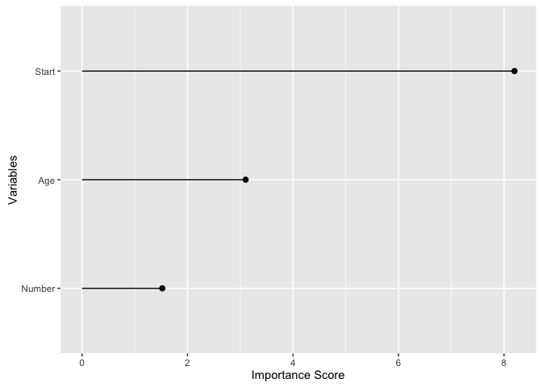
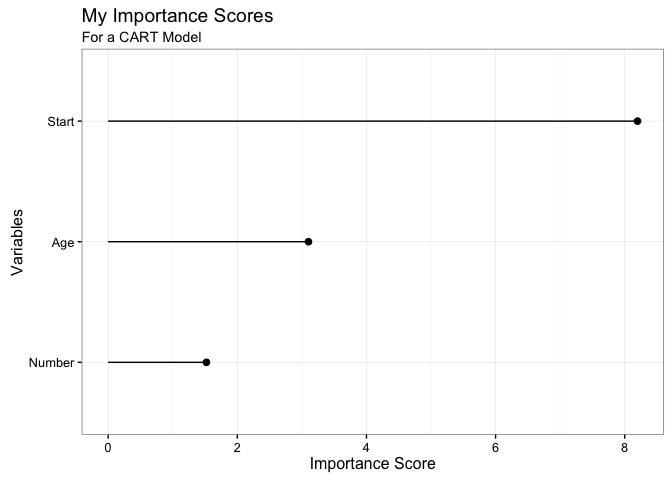
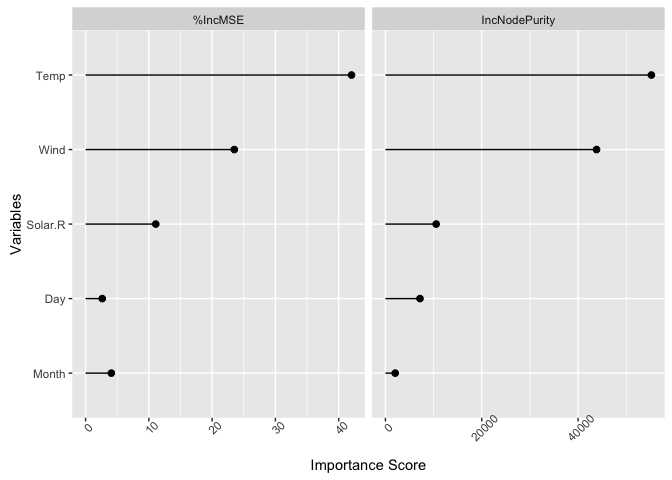
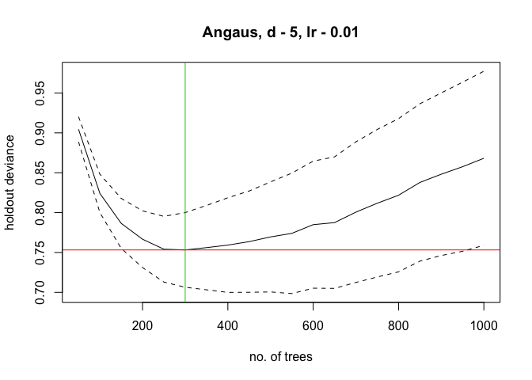
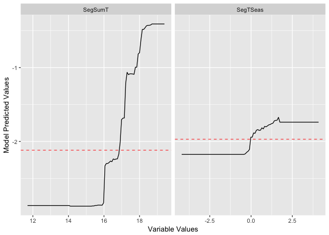

treezy
======

[](https://travis-ci.org/njtierney/treezy)[](https://ci.appveyor.com/project/njtierney/treezy)

Makes handling output from decision trees easy. Treezy.

Decision trees are a commonly used tool in statistics and data science, but sometimes getting the information out of them can be a bit difficult. This package makes it easy to work with decision trees, hence, `treezy`. These functions are more formal reworkings from the helper functions I had written in [neato](www.github.com/njtierney/neato). The treezy package is inspired by David Robinson's excellent [`broom`](https://github.com/tidyverse/broom) package. Perhaps one day these functions will make their way into broom, but for the moment this package will focus on decision trees, which tend to give different output to many of the (many!) [packages/analyses that broom deals with](https://github.com/tidyverse/broom#available-tidiers).

**treezy is very much in a beta stage, please use it with that in mind**

<!-- README.md is generated from README.Rmd. Please edit that file -->
Installation
============

``` r

# install.packages("devtools")
devtools::install_github("njtierney/treezy")
```

Example usage
=============

Explore variable importance with `importance_table` and `importance_plot`
-------------------------------------------------------------------------

### rpart

``` r

library(treezy)
library(rpart)

fit_rpart_kyp <- rpart(Kyphosis ~ ., data = kyphosis)
```

``` r

# default method for looking at importance

# variable importance
fit_rpart_kyp$variable.importance
#>    Start      Age   Number 
#> 8.198442 3.101801 1.521863

# with treezy

importance_table(fit_rpart_kyp)
#> # A tibble: 3 × 2
#>   variable importance
#>     <fctr>      <dbl>
#> 1    Start   8.198442
#> 2      Age   3.101801
#> 3   Number   1.521863

importance_plot(fit_rpart_kyp)
```



``` r

# extend and modify
library(ggplot2)
importance_plot(fit_rpart_kyp) + 
    theme_bw() + 
    labs(title = "My Importance Scores",
         subtitle = "For a CART Model")
```



### randomForest

``` r
library(randomForest)
set.seed(131)
fit_rf_ozone <- randomForest(Ozone ~ ., 
                             data = airquality, 
                             mtry=3,
                             importance=TRUE, 
                             na.action=na.omit)
  
fit_rf_ozone
#> 
#> Call:
#>  randomForest(formula = Ozone ~ ., data = airquality, mtry = 3,      importance = TRUE, na.action = na.omit) 
#>                Type of random forest: regression
#>                      Number of trees: 500
#> No. of variables tried at each split: 3
#> 
#>           Mean of squared residuals: 303.8304
#>                     % Var explained: 72.31

## Show "importance" of variables: higher value mean more important:

# randomForest has a better importance method than rpart
importance(fit_rf_ozone)
#>           %IncMSE IncNodePurity
#> Solar.R 11.092244     10534.237
#> Wind    23.503562     43833.128
#> Temp    42.027171     55218.049
#> Month    4.070413      2032.652
#> Day      2.632496      7173.194

## use importance_table
importance_table(fit_rf_ozone)
#> # A tibble: 5 × 3
#>   variable `%IncMSE` IncNodePurity
#>     <fctr>     <dbl>         <dbl>
#> 1  Solar.R 11.092244     10534.237
#> 2     Wind 23.503562     43833.128
#> 3     Temp 42.027171     55218.049
#> 4    Month  4.070413      2032.652
#> 5      Day  2.632496      7173.194

# now plot it
importance_plot(fit_rf_ozone)
```



Calculate residual sums of squares for rpart and randomForest
-------------------------------------------------------------

``` r

# CART
rss(fit_rpart_kyp)
#> [1] 13

# randomForest
rss(fit_rf_ozone)
#> [1] 33725.18
```

plot partial effects
--------------------

Using gbm.step from dismo package
---------------------------------

``` r
# using gbm.step from the dismo package
library(gbm)
library(dismo)
# load data
data(Anguilla_train)

anguilla_train <- Anguilla_train[1:200,]

# fit model
angaus_tc_5_lr_01 <- gbm.step(data = anguilla_train,
                              gbm.x = 3:14,
                              gbm.y = 2,
                              family = "bernoulli",
                              tree.complexity = 5,
                              learning.rate = 0.01,
                              bag.fraction = 0.5)
#> 
#>  
#>  GBM STEP - version 2.9 
#>  
#> Performing cross-validation optimisation of a boosted regression tree model 
#> for Angaus and using a family of bernoulli 
#> Using 200 observations and 12 predictors 
#> creating 10 initial models of 50 trees 
#> 
#>  folds are stratified by prevalence 
#> total mean deviance =  1.0905 
#> tolerance is fixed at  0.0011 
#> ntrees resid. dev. 
#> 50    0.9103 
#> now adding trees... 
#> 100   0.8352 
#> 150   0.7996 
#> 200   0.7808 
#> 250   0.7708 
#> 300   0.7664 
#> 350   0.7664 
#> 400   0.772 
#> 450   0.7851 
#> 500   0.7912 
#> 550   0.7964 
#> 600   0.8025 
#> 650   0.8107 
#> 700   0.8205 
#> 750   0.8267 
#> 800   0.8351 
#> 850   0.8497 
#> 900   0.8606 
#> 950   0.8756 
#> 1000   0.8903
```



    #> 
    #> mean total deviance = 1.09 
    #> mean residual deviance = 0.408 
    #>  
    #> estimated cv deviance = 0.766 ; se = 0.053 
    #>  
    #> training data correlation = 0.86 
    #> cv correlation =  0.559 ; se = 0.053 
    #>  
    #> training data AUC score = 0.986 
    #> cv AUC score = 0.867 ; se = 0.022 
    #>  
    #> elapsed time -  0.06 minutes

``` r

gg_partial_plot(angaus_tc_5_lr_01,
                var = c("SegSumT",
                        "SegTSeas"))
```



Known issues
============

treezy is in a beta stage at the moment, so please use with caution. Here are a few things to keep in mind:

-   The functions **have not been made compatible with Gradient Boosted Machines**, but this is on the cards. This was initially written for some old code which used gbm.step
-   The partial dependence plots have not been tested, and were initially intended for use with gbm.step, as in the [elith et al. paper](https://cran.r-project.org/web/packages/dismo/vignettes/brt.pdf)

Future work
===========

-   Extend to other kinds of decision trees (`gbm`, `tree` and more)
-   provide tools for extracting out other decision tree information (decision tree rules, surrogate splits, burling).
-   provide a method to extract out decision trees from randomForest and BRT so that they can be visualised with rpart.plot,
-   provide tidy summary information of the decision trees, potentially in the format of `broom`'s `augment`, `tidy`, and `glance` functions. For example, `rpart_fit$splits`
-   think about a way to store the data structure of a decision tree as a nested dataframe
-   functions to allow for plotting of a prediction grid over two variables

Acknowledgements
================

Credit for the name, "treezy", goes to @MilesMcBain, thanks Miles!
